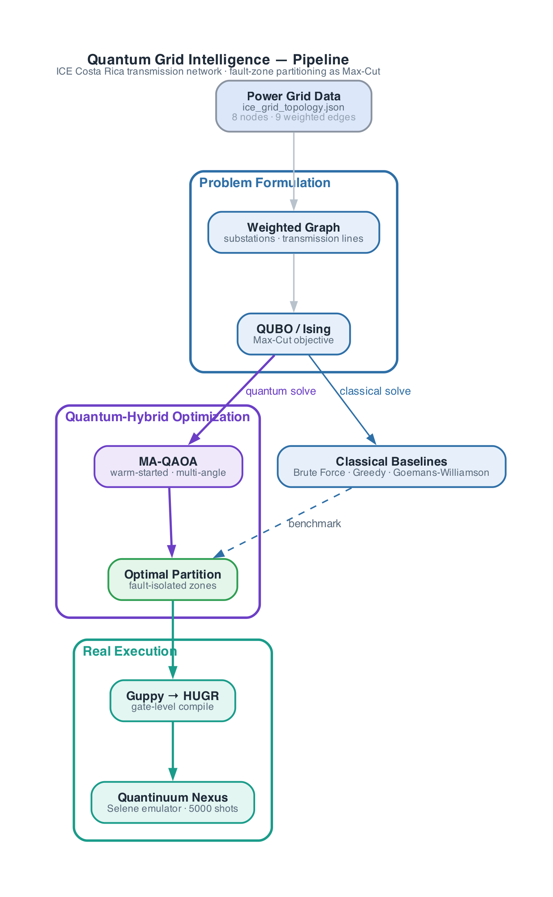
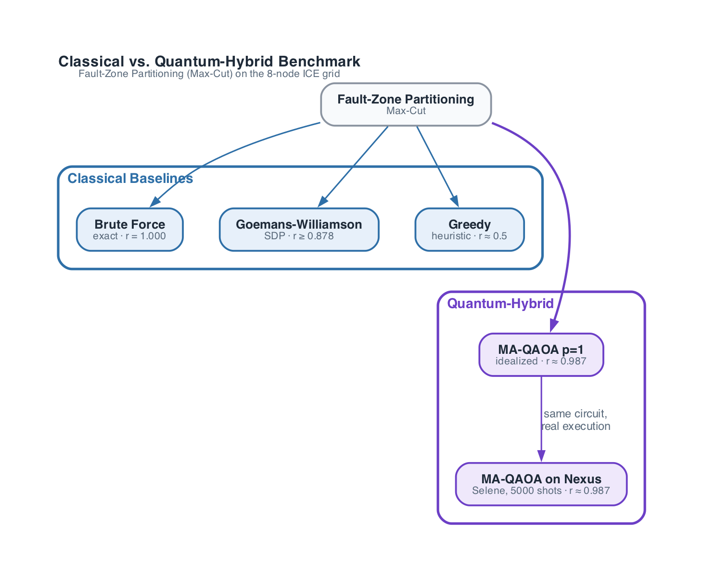
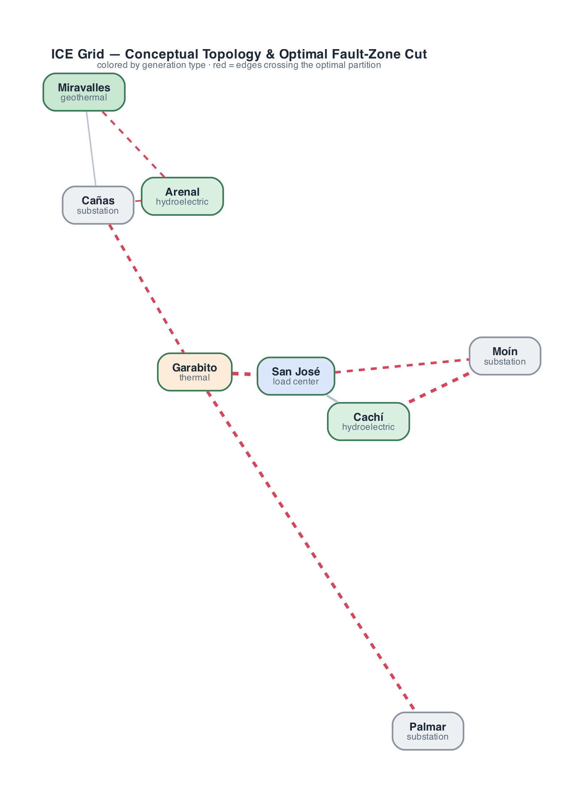
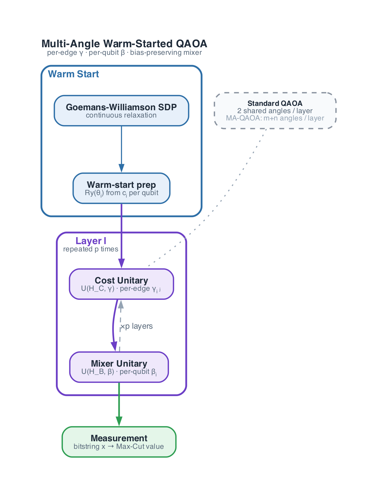
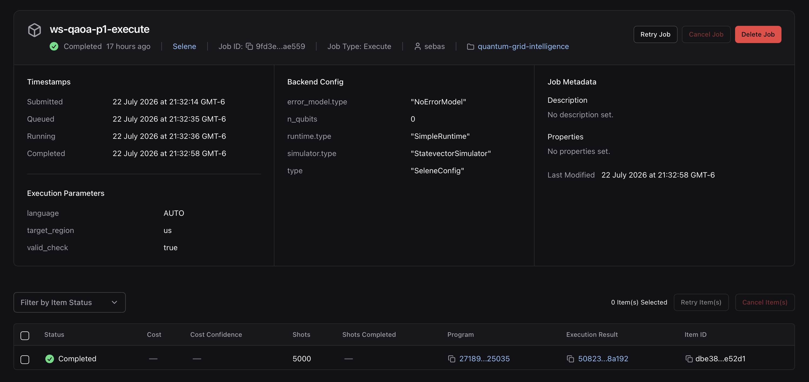
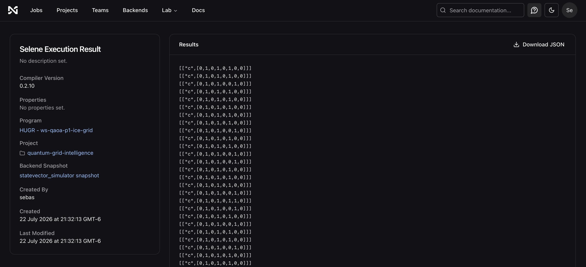

<p align="center">
  
</p>

<h1 align="center">Quantum Grid Intelligence — Powering the AI Era</h1>

<p align="center">
  <a href="WHITEPAPER.md"></a>
  <a href="WHITEPAPER_ES.md"></a>
  
  
  
</p>

> Optimizing tomorrow's energy grid today.
> Reducing Energy Losses · Improving Grid Resilience · Enabling Smarter Energy Distribution

**Quantathon CR 2026 · Challenge 1**: Sustainable, Resilient, and Green Power Grid (Fault-Zone Partitioning)

---

## The Problem

AI is driving an unprecedented surge in electricity demand:
- AI data center electricity consumption is projected to **more than double by 2030**
- Data centers could account for up to **9% of U.S. electricity demand** by 2030
- Building new transmission infrastructure takes **5–10 years**

The challenge isn't generating more electricity. **It's using today's grid more intelligently.**

## Our Approach

We model Costa Rica's ICE (Instituto Costarricense de Electricidad) transmission network as a weighted graph and solve the **fault-zone partitioning** problem — dividing the grid into isolated segments that can self-heal during faults — as a **Max-Cut** optimization problem, using a custom **Multi-Angle Warm-Started QAOA (MA-QAOA)**, benchmarked against classical baselines, and validated with real execution on **Quantinuum Nexus**.

<p align="center">
  
</p>

### Methods

<p align="center">
  
</p>

| Method | Type | Approximation Guarantee |
|---|---|---|
| Brute Force | Exact (exponential) | r = 1.000 |
| Goemans-Williamson | Classical SDP relaxation | r ≥ 0.878 |
| Greedy | Classical heuristic | r ≈ 0.5 |
| **MA-QAOA p=1** | **Multi-Angle Warm-Started Quantum Hybrid** | **r ≈ 0.987 best of 10 (0.905 mean)** |
| **MA-QAOA p=1 on Nexus** | **Same circuit, executed on Quantinuum Nexus** | **r ≈ 0.987 (real shots, matches idealized)** |

## SDG Alignment

- **SDG 7** (Affordable & Clean Energy): Improves grid reliability, maximizes renewable integration
- **SDG 9** (Industry, Innovation & Infrastructure): Quantum-enhanced grid optimization
- **SDG 13** (Climate Action): Reduces cascading outages, cuts diesel backup emissions

## Grid Topology

8-node simplified representation of the ICE transmission network:

<p align="center">
  
</p>

| Node | Name | Type | Capacity (MW) |
|---|---|---|---|
| 0 | Arenal | Hydroelectric | 157 |
| 1 | Miravalles | Geothermal | 163 |
| 2 | Cañas | Substation | — |
| 3 | Garabito | Thermal | 200 |
| 4 | San José | Load Center | — |
| 5 | Cachí | Hydroelectric | 103 |
| 6 | Moín | Substation | — |
| 7 | Palmar | Substation | — |

Source: Topology derived from [ICE Open Data Portal](https://datos-ice-se.opendata.arcgis.com) and public transmission maps.

## Quick Start

### Requirements

```bash
pip install -r requirements.txt
```

### Run (reproduces all figures and results)

```bash
python quantum_grid_intelligence.py
```

This generates:
- `results/approximation_ratio_vs_p.png` — Approximation ratio r vs QAOA depth p (with error bars)
- `results/grid_before_after.png` — Before/After fault-zone partitioning visualization
- `results/convergence_landscape.png` — 2D slice through MA-QAOA's p=1 cost landscape (the 2 most sensitive of 17 parameters, 15 others fixed at their optimum)
- `results/grid_partitioned_qaoa.png` — Optimal partition visualization
- `results/benchmark_table.csv` — Full benchmark comparison

### Run on Quantinuum Nexus (real execution, not just simulation)

```bash
python guppy_qaoa.py     # builds + compiles the MA-QAOA circuit in Guppy (no Nexus needed)
python run_on_nexus.py   # uploads the compiled HUGR and executes it on Nexus's Selene emulator
```

`run_on_nexus.py` requires an authenticated Nexus session (`qnx.login()`, browser-based device
code flow — see [Real Execution on Quantinuum Nexus](#real-execution-on-quantinuum-nexus) below).

### Regenerate the diagrams

```bash
python scripts/diagrams/render-all.py
```

Renders all 5 architecture/flow diagrams to `docs/diagrams/output/{horizontal,vertical}/` as SVG + PNG — horizontal for slides, vertical for docs/README. See [WHITEPAPER.md](WHITEPAPER.md) for the full academic writeup.

## Project Structure

```
quantum-grid-intelligence/
├── README.md                          # This file
├── WHITEPAPER.md / WHITEPAPER.pdf     # Full academic whitepaper (EN)
├── WHITEPAPER_ES.md / WHITEPAPER_ES.pdf  # Full academic whitepaper (ES)
├── TOOLKIT_STATEMENT.md               # Pytket/Quantinuum SDK evaluation
├── requirements.txt                   # Python dependencies
├── quantum_grid_intelligence.py       # Single entry-point script (all code)
├── guppy_qaoa.py                      # MA-QAOA circuit expressed in Guppy, compiled to HUGR
├── run_on_nexus.py                    # Uploads + executes the HUGR on Quantinuum Nexus (Selene)
├── data/
│   └── ice_grid_topology.json         # ICE Costa Rica grid topology (8 nodes)
├── results/                           # Auto-generated outputs
│   ├── grid_topology.png
│   ├── approximation_ratio_vs_p.png
│   ├── grid_before_after.png
│   ├── convergence_landscape.png
│   ├── grid_partitioned_qaoa.png
│   └── benchmark_table.csv
├── nexus/                             # Screenshots — Quantinuum Nexus execution evidence
├── scripts/diagrams/                  # Diagram source (Python + graphviz), see below
├── docs/diagrams/output/              # Rendered diagrams (horizontal + vertical, SVG + PNG)
└── whitepaper/                        # Whitepaper build tooling (typst template, build.sh)
```

## Algorithmic Innovation: Multi-Angle Warm-Started QAOA (MA-QAOA)

Standard QAOA struggles at low circuit depths ($p=1$), with a theoretical performance guarantee (0.6924) strictly below the classical Goemans-Williamson limit (0.878).

We combine two ideas to close that gap. **Warm-starting**: each qubit is initialized with the continuous SDP probability $c_i$ derived from Goemans-Williamson (instead of a uniform superposition), paired with a custom bias-preserving mixer Hamiltonian per qubit. **Multi-angle parameterization (MA-QAOA)**: instead of two global angles $(\gamma, \beta)$ per layer, every edge gets its own $\gamma_{ij}$ and every qubit its own $\beta_i$ — more variational freedom at the cost of more classical parameters to optimize.

<p align="center">
  
</p>

**Results on 8-node Grid** (10 independent random-restart runs per depth):

| Depth $p$ | Free parameters | Best of 10 (r) | Mean ± std (r) |
|---|---|---|---|
| 1 | 17 (9 γ + 8 β) | 0.987 | 0.905 ± 0.065 |
| 2 | 34 | 0.997 | 0.979 ± 0.022 |
| 3 | 51 | 1.000 | 0.996 ± 0.003 |

See *Honest Limitations* below for why the $p=1$ number needs a grain of salt.

## Real Execution on Quantinuum Nexus

The result above comes from an idealized, noiseless NumPy statevector simulation. To go beyond
"we built a circuit but never ran it" (see `TOOLKIT_STATEMENT.md`), the same MA-QAOA circuit is
also expressed natively in **Guppy** (Quantinuum's Python-embedded quantum language,
`guppy_qaoa.py`), compiled to **HUGR**, and executed for real on **Quantinuum Nexus** against the
Nexus-hosted **Selene emulator** (`run_on_nexus.py`) — a noiseless statevector backend reached via
genuine shot-based execution (upload → execute job → 5000 shots → measurement counts), not a
second local simulation. Every edge's `zz_phase` gets its own γ, and every qubit's mixer gets its
own β — the full MA-QAOA parameterization, not a reduced two-angle version.

Translating the mixer (a custom bias-preserving 2×2 unitary in NumPy) into native gates required
an exact decomposition: `R_n(2β) = Ry(θ)·Rz(2β)·Ry(-θ)`, derived analytically and verified
numerically against the original matrix before being written into the circuit.

**Results (p=1):**

| Execution | Cut value | Ratio r |
|---|---|---|
| MA-QAOA idealized (NumPy statevector) | 35.139 | 0.987 |
| MA-QAOA on Nexus (Selene emulator, 5000 shots) | 35.130 | 0.987 |

The two agree to within shot noise, confirming the Guppy circuit is a faithful re-expression of
the NumPy one — now validated on real Quantinuum execution infrastructure instead of only a
hand-rolled simulator.

**Evidence from the Quantinuum Nexus dashboard:**

<p align="center">
  
  <br><sub>Job configuration — <code>SeleneConfig</code>, <code>NoErrorModel</code>, <code>StatevectorSimulator</code>, 5000 shots.</sub>
</p>
<p align="center">
  
  <br><sub>Raw Selene measurement counts, fed into <code>energy_from_counts()</code>.</sub>
</p>

See [WHITEPAPER.md §4.4](WHITEPAPER.md#44-real-execution-on-quantinuum-nexus) for the full evidence trail (HUGR upload, job list, job detail, results) and gate-level translation details.

## Honest Limitations

1. **No Quantum Advantage at 8 Nodes**: Classical algorithms (Brute Force, GW) achieve 100% accuracy instantly on this toy graph. Our MA-QAOA ratios serve as a proof of concept for a scalable hybrid methodology, not an absolute victory on this specific micro-instance.
2. **More classical parameters than the problem needs, at this scale**: MA-QAOA's $p=1$ circuit already has 17 free parameters (9 per-edge γ + 8 per-qubit β) optimized classically against a search space of only 256 states. At this size, some of the improvement over standard QAOA plausibly comes from that extra classical optimization freedom rather than from a quantum effect — this ratio should be expected to compress as the grid scales and the parameter-to-state-space ratio drops.
3. **Selene emulator ≠ physical quantum hardware**: the Nexus run above uses Selene's noiseless statevector backend, not a physical device or a noisy hardware emulator — it validates the circuit's correctness on real Quantinuum execution infrastructure, but does not yet demonstrate resilience to hardware noise.
4. **Simplified topology**: The real ICE network has hundreds of nodes. Our model captures conceptual structure, not computational complexity.
5. **Optimizer sensitivity**: Even with a warm start, the quantum optimization landscape remains non-convex and susceptible to local minima — MA-QAOA's larger parameter count makes this worse, not better, at higher $p$. γ*/β* are still optimized against the idealized NumPy simulator and only afterwards baked into the Nexus circuit as fixed constants — a full closed-loop optimization against real Nexus shots (as in Quantinuum's own QAOA examples) is future work.

See [WHITEPAPER.md §6](WHITEPAPER.md#6-honest-limitations) for the full discussion.

## Whitepaper

The full academic writeup — abstract, math formulation, algorithm architecture, results, and honest limitations — is available as:
- [WHITEPAPER.md](WHITEPAPER.md) / [WHITEPAPER.pdf](WHITEPAPER.pdf) (English)
- [WHITEPAPER_ES.md](WHITEPAPER_ES.md) / [WHITEPAPER_ES.pdf](WHITEPAPER_ES.pdf) (Español)

Authors: **Kevin Membreño** and **Sebastián Salazar**, Team QuantumHackathon — Quantathon CR 2026.

## References

- Farhi, E., Goldstone, J., & Gutmann, S. (2014). *A Quantum Approximate Optimization Algorithm*. arXiv:1411.4028.
- Goemans, M. X., & Williamson, D. P. (1995). *Improved approximation algorithms for maximum cut*. JACM, 42(6).
- Blekos, K., et al. (2024). *A review on QAOA*.
- Jin, J., et al. (2025). arXiv:2504.21172.
- ICE Open Data: [datos-ice-se.opendata.arcgis.com](https://datos-ice-se.opendata.arcgis.com)
- Quantinuum Guppy documentation: [docs.quantinuum.com/guppy](https://docs.quantinuum.com/guppy/)
- Quantinuum Nexus documentation: [docs.quantinuum.com/nexus](https://docs.quantinuum.com/nexus/)

## License

MIT
