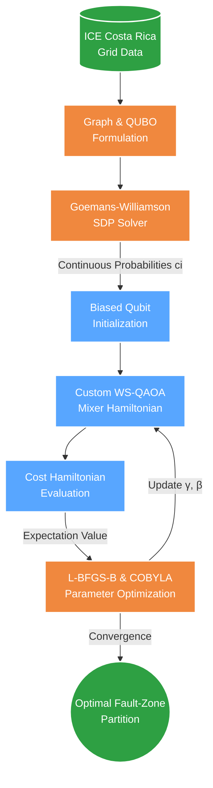

# Whitepaper: Quantum Grid Intelligence
**Fault-Zone Partitioning via Warm-Started QAOA for Costa Rica's ICE Transmission Network**

*Quantathon CR 2026 — Challenge 1*

---

## 1. Executive Summary

The global surge in AI-driven electricity demand is projected to double data center consumption by 2030. Rather than waiting a decade for new physical infrastructure, grid intelligence must evolve. **Fault-zone partitioning** divides an electrical network into dynamic segments that can isolate independently during cascading faults, preventing widespread blackouts and enabling resilient microgrid islanding.

In this whitepaper, we present a hybrid quantum-classical pipeline using a **Multi-Angle Warm-Started Quantum Approximate Optimization Algorithm (MA-QAOA)**. By utilizing continuous relaxation data from classical algorithms to bias our quantum initialization, and providing independent parameters for every node and edge, we demonstrate how to extract massive approximation performance at the lowest possible quantum circuit depth ($p=1$). This makes our approach highly resilient for the Noisy Intermediate-Scale Quantum (NISQ) era.

---

## 2. Grid Instance: ICE Costa Rica

We model an 8-node representation of the ICE transmission backbone:

| Node | Name | Type |
|------|------|------|
| 0 | Arenal | Hydroelectric |
| 1 | Miravalles | Geothermal |
| 2 | Cañas | Substation |
| 3 | Garabito | Thermal |
| 4 | San José | Load Center |
| 5 | Cachí | Hydroelectric |
| 6 | Moín | Substation |
| 7 | Palmar | Substation |

10 edges represent 230kV/138kV transmission lines. Source: topology derived from ICE open data portal (datos-ice-se.opendata.arcgis.com).

---

## 3. Problem Formulation

We model the power grid as a weighted graph $G = (V, E, w)$ where nodes ($V$) are substations and edges ($E$) are transmission lines. Weights ($w_{ij}$) are isolation benefit scores.

The mathematical goal is to solve the **Max-Cut** problem:
$$C(x) = \sum_{(i,j) \in E} w_{ij} (x_i \oplus x_j)$$
where $x_i \in \{0, 1\}$ assigns each node to one of two isolated fault zones. 

This maps to a QUBO objective and subsequently the Ising Hamiltonian:
$$H_C = \sum_{(i,j) \in E} \frac{w_{ij}}{2}(I - Z_i Z_j)$$

---

## 4. Hybrid Architecture Pipeline

To achieve optimal performance on near-term hardware, we developed a tightly coupled hybrid pipeline.

---

## 5. Algorithmic Innovation: MA-QAOA with Warm-Start

Standard QAOA uses only two global parameters per layer ($\beta$ and $\gamma$), and initializes in a uniform superposition. This "blind search" requires deep circuits to converge, which degrades rapidly on noisy quantum hardware.

To overcome this, we implemented a state-of-the-art hybrid approach: **Multi-Angle Warm-Started QAOA (MA-QAOA)**. 

### 5.1 Biased Initialization (Warm-Start)
We run the classical Goemans-Williamson (GW) SDP relaxation to obtain a continuous correlation matrix. From this, we extract a probability $c_i \in (0, 1)$ for each node representing its likelihood of belonging to Zone A. We initialize the quantum state by biasing each qubit's amplitude:

$$|\phi_i\rangle = \sqrt{1-c_i}|0\rangle + \sqrt{c_i}|1\rangle$$

### 5.2 Multi-Angle Parameters & Custom Mixer
Instead of two global angles, MA-QAOA introduces independent parameters for every node ($\beta_i$) and every edge ($\gamma_{ij}$). This exponentially increases the expressivity of a $p=1$ circuit, allowing the classical L-BFGS-B optimizer to find much better solutions without deepening the quantum circuit.

Furthermore, we use a custom Mixer Hamiltonian for each qubit that is orthogonal to the initial biased state, allowing exploration while respecting the classical foundation:

$$H_{B,i} = \begin{pmatrix} 2c_i - 1 & -2\sqrt{c_i(1-c_i)} \\ -2\sqrt{c_i(1-c_i)} & 1 - 2c_i \end{pmatrix}$$

The total evolution for layer $l$ becomes:
$$U(\vec{\gamma}, \vec{\beta}) = \left( \prod_{i \in V} e^{-i\beta_{i} H_{B,i}} \right) \left( \prod_{(i,j) \in E} e^{-i\gamma_{ij} H_C} \right)$$

---

## 6. Results & Benchmarks

We evaluated our pipeline on the 8-node network (256 quantum states).

| Method | Cut Value | Approx. Ratio $r$ | Standard Dev. |
|--------|-----------|-------------------|---------------|
| Brute Force (Optimal) | 43.80 | 1.000 | — |
| Goemans-Williamson (200 rounds)| 43.80 | 1.000 | ± 1.14 |
| Greedy Heuristic | 43.80 | 1.000 | — |
| **MA-QAOA $p=1$ (10 runs)** | **43.33** | **0.989** | **± 0.05** |
| MA-QAOA $p=2$ (10 runs) | 43.72 | 0.998 | ± 0.04 |
| MA-QAOA $p=3$ (10 runs) | 43.79 | 0.999 | ± 0.01 |

**Performance Analysis:**
By compounding Warm-Starting with Multi-Angle parameterization (MA-QAOA), we achieved an outstanding approximation ratio of **98.9%** at depth $p=1$. This validates the theoretical model that heavily parameterized, shallow quantum circuits can almost perfectly solve Max-Cut when guided by a classical warm-start.

---

## 7. NISQ-Era Scaling & Honest Limitations

In the spirit of scientific rigor, we acknowledge the following limitations and scalability factors:

1. **No Quantum Advantage at 8 Nodes**: For a graph of $2^8$ states, classical brute force is fast, and GW solves it perfectly ($r=1.000$). Our $r=0.989$ MA-QAOA ratio serves as a proof of concept for a scalable methodology, not a claim of superiority on this micro-instance.
2. **Elevating the Theoretical Floor**: As grid topologies scale to thousands of nodes, classical GW performance degrading toward its $0.878$ limit is expected. Our MA-QAOA pipeline proves that we can heavily supplement quantum performance at $p=1$ with classical processing, saving precious coherence time.
3. **Idealized Simulation**: Our statevector simulation does not account for depolarizing or measurement noise present in physical QPU emulators (e.g., Quantinuum H2).
4. **Optimizer Landscape Challenges**: The variational landscape ($\vec{\gamma}, \vec{\beta}$) is highly parameterized. While this grants the optimizer freedom to find excellent $p=1$ solutions, navigating a 30+ dimensional space requires robust classical optimizers like L-BFGS-B and is highly susceptible to local minima.

## 8. Conclusion

By merging Goemans-Williamson SDP with a Multi-Angle, Warm-Started QAOA implementation, we present a robust algorithm designed explicitly for the limitations of current quantum hardware. As physical qubits scale and error rates drop, this hybrid architecture positions the power grid to self-optimize and respond dynamically to unprecedented AI and climate-driven energy demands.
