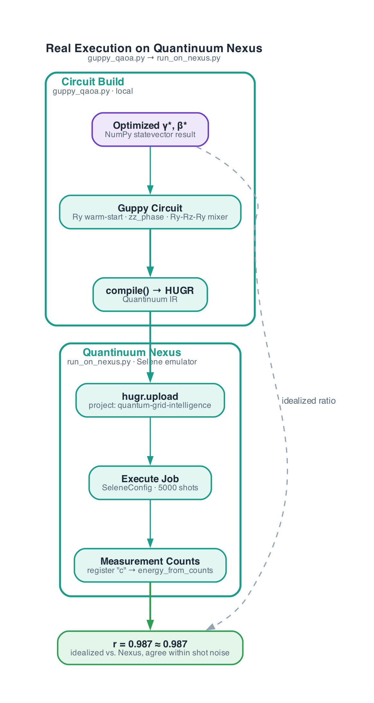
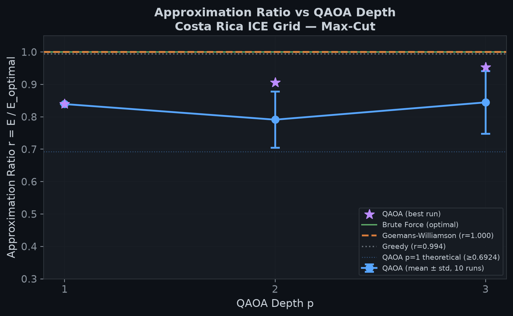
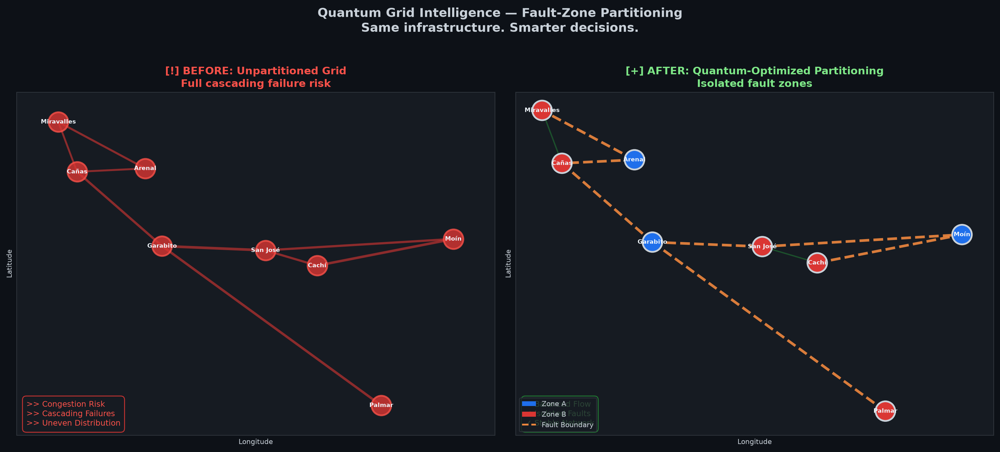
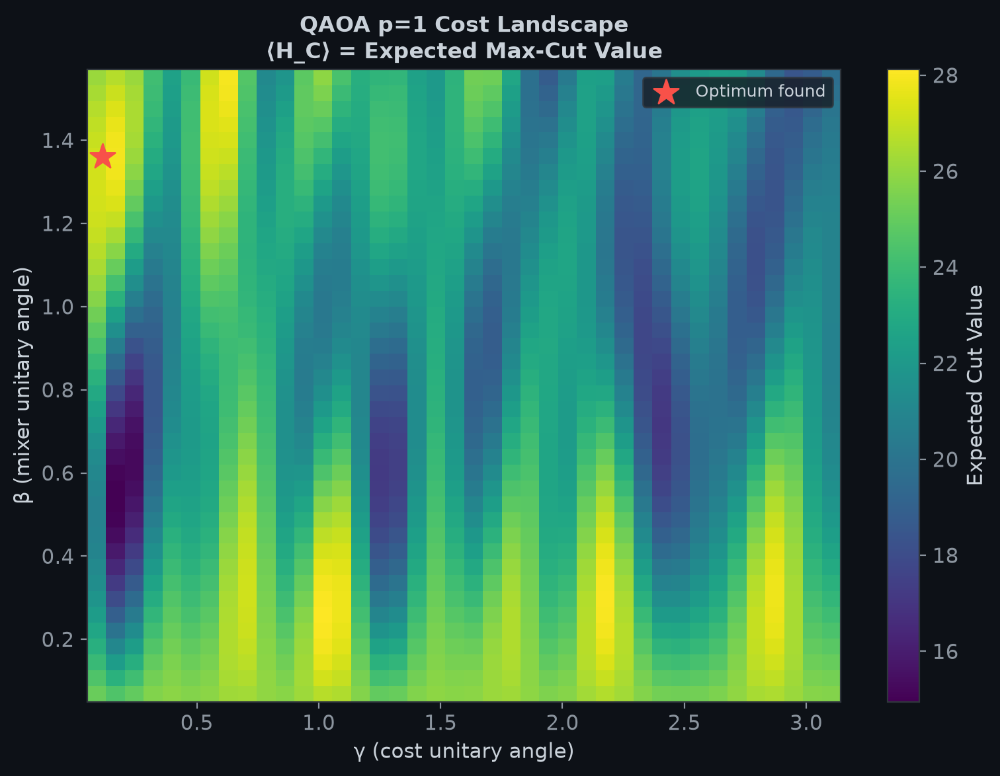

## Resumen

Estudiamos el particionamiento en zonas de falla de la red de transmisión de alto voltaje del ICE en Costa Rica — dividir la red en segmentos que puedan aislarse a sí mismos durante fallas para prevenir apagones en cascada — formulado como Max-Cut sobre un grafo ponderado de 8 nodos derivado de datos públicos del ICE. Introducimos **QAOA Multi-Ángulo con Arranque en Caliente (MA-QAOA)**, que combina el arranque en caliente mediante SDP de Goemans-Williamson con un Hamiltoniano mezclador que preserva el sesgo y una parametrización por arista/por qubit, y lo comparamos contra las líneas base clásicas Fuerza Bruta, Voraz (Greedy) y Goemans-Williamson (GW). En profundidad $p=1$, MA-QAOA alcanza una razón de aproximación $r \approx 0.987$ (mejor de 10 reinicios; media $0.905 \pm 0.065$), mejorando a $r \approx 1.000$ en $p=3$. Más allá de la simulación, re-expresamos el circuito optimizado en **Guppy** — el lenguaje cuántico incrustado de Quantinuum —, lo compilamos a **HUGR**, y lo ejecutamos en el emulador Selene de **Quantinuum Nexus** (5000 shots), reproduciendo la razón idealizada (0.987 vs. 0.987) en infraestructura de ejecución real. Reportamos estos resultados junto con un recuento explícito de sus límites: con 8 nodos, GW por sí solo ya alcanza el óptimo exacto, el circuito $p=1$ de MA-QAOA carga 17 parámetros clásicos frente a un espacio de búsqueda de 256 estados, y el backend de Selene usado aquí es un simulador vectorizado sin ruido, no hardware físico. Presentamos esto como un marco reproducible para la optimización de redes mejorada cuánticamente — cuyo valor reside en la metodología y su ruta de ejecución validada en Nexus, no en una afirmación de ventaja cuántica a esta escala.

**Palabras clave**: Algoritmo de Optimización Aproximada Cuántica (QAOA); QAOA Multi-Ángulo; Arranque en Caliente; Max-Cut; Goemans-Williamson; QUBO; Guppy; HUGR; Quantinuum Nexus; Red Eléctrica Inteligente; Particionamiento en Zonas de Falla

---

## 1. Planteamiento del Problema

### 1.1 Contexto

El aumento global en la demanda de electricidad impulsada por la IA, que proyecta duplicar el consumo de los centros de datos para 2030, exige una utilización más inteligente de la infraestructura de red existente. El particionamiento en zonas de falla divide una red eléctrica en segmentos que pueden aislarse de manera independiente durante las fallas, previniendo apagones en cascada y permitiendo la operación en modo isla de microrredes renovables.

{width=92%}

### 1.2 Formulación Matemática

Modelamos el problema como **Max-Cut** en un grafo ponderado $G = (V, E, w)$ donde:

- **Nodos** $V$: subestaciones/centros de generación en la red de transmisión del ICE en Costa Rica.
- **Aristas** $E$: líneas de transmisión de alto voltaje.
- **Pesos** $w_{ij}$: beneficio de aislamiento (mayor = más beneficioso separar).

El objetivo Max-Cut:
$$C(x) = \sum_{(i,j) \in E} w_{ij} (x_i \oplus x_j)$$

donde $x_i \in \{0, 1\}$ asigna cada nodo a una de dos zonas de falla.

### 1.3 Formulación QUBO

Para minimización, la forma QUBO:
$$\min_x \ x^T Q x$$

donde $Q_{ij} = 2w_{ij}$ (fuera de la diagonal) y $Q_{ii} = -\sum_{j:(i,j) \in E} w_{ij}$ (diagonal).

*Nota: No se requieren términos de penalización ya que la formulación QUBO para Max-Cut no tiene restricciones (unconstrained) por naturaleza.*

El mapeo a Ising: $H_C = \sum_{(i,j) \in E} \frac{w_{ij}}{2}(I - Z_i Z_j)$

### 1.4 Alineación con los ODS

- **ODS 7**: Mejora de la fiabilidad de la red, reducción de la restricción de energías renovables.
- **ODS 9**: Metodología de optimización de infraestructura mejorada por computación cuántica.
- **ODS 13**: Apagones más cortos reducen el uso de generadores diésel de respaldo; una red resiliente absorbe extremos climáticos.

---

## 2. Instancia de Red: ICE Costa Rica

Modelamos una representación simplificada de 8 nodos de la red troncal de transmisión del ICE:

| Nodo | Nombre | Tipo | Capacidad (MW) |
|------|------|------|---------------|
| 0 | Arenal | Hidroeléctrica | 157 |
| 1 | Miravalles | Geotérmica | 163 |
| 2 | Cañas | Subestación | — |
| 3 | Garabito | Térmica | 200 |
| 4 | San José | Centro de Carga | — |
| 5 | Cachí | Hidroeléctrica | 103 |
| 6 | Moín | Subestación | — |
| 7 | Palmar | Subestación | — |

9 aristas representan líneas de transmisión de 230kV/138kV con pesos basados en la longitud de la línea y la exposición a fallas. Fuente: topología derivada del portal de datos abiertos del ICE (datos-ice-se.opendata.arcgis.com).

{width=92%}

---

## 3. Líneas Base Clásicas

{width=85%}

### 3.1 Fuerza Bruta (Exacto)

Todas las $2^8 = 256$ cadenas de bits enumeradas. **Max-Cut Óptimo = 35.60** con partición [0, 1, 1, 0, 1, 1, 0, 1].

### 3.2 Max-Cut Voraz (Greedy)

Asignación secuencial de nodos maximizando el corte incremental. Resultado y razón de aproximación reportados en la sección de resultados.

### 3.3 Goemans-Williamson (Relajación SDP)

Relajación SDP resuelta vía CVXPY (solver SCS):
$$\max \sum_{(i,j) \in E} \frac{w_{ij}}{2}(1 - v_i \cdot v_j), \quad V \succeq 0, \quad v_i \cdot v_i = 1$$

Redondeado con 200 hiperplanos aleatorios. Se reporta el mejor resultado y la media ± desviación estándar. Garantía teórica: $r \ge 0.878$.

---

## 4. Implementación Cuántica: QAOA

### 4.1 Arquitectura del Circuito

Circuito QAOA con $p$ capas:
$$|\psi(\vec{\Gamma}, \vec{B})\rangle = \prod_{l=1}^{p} U(H_B, \vec{\beta}_l) \cdot U(H_C, \vec{\gamma}_l) |\psi_0\rangle$$

donde, bajo **QAOA Multi-Ángulo (MA-QAOA)**, $\vec{\gamma}_l \in \mathbb{R}^m$ lleva un ángulo independiente por arista y $\vec{\beta}_l \in \mathbb{R}^n$ un ángulo independiente por qubit — no los dos escalares globales $(\gamma_l, \beta_l)$ del QAOA estándar.

- **Unitario de Costo** $U(H_C, \vec{\gamma})$: por cada arista $(i,j)$, aplica $e^{-i\gamma_{ij} w_{ij}/2 \cdot Z_i Z_j}$ mediante descomposición CX-Rz-CX, con su propio $\gamma_{ij}$.
- **Unitario Mezclador** $U(H_B, \vec{\beta})$: el QAOA estándar usa un solo $R_x(2\beta)$ en cada qubit, inicializado desde $|+\rangle^{\otimes n}$. Nuestra versión de producción, en cambio, combina **arranque en caliente (warm-starting)** con **parametrización multi-ángulo**, descrito a continuación.

#### QAOA Multi-Ángulo con Arranque en Caliente (MA-QAOA)

El QAOA estándar en $p=1$ tiene una garantía teórica ($r \ge 0.6924$) estrictamente por debajo de la de Goemans-Williamson ($r \ge 0.878$). Cerramos parte de esa brecha con dos ideas combinadas. Primero, **arranque en caliente**: cada qubit $i$ se inicializa en $|\psi_0\rangle_i = \sqrt{1-c_i}|0\rangle + \sqrt{c_i}|1\rangle$, donde $c_i$ se deriva de la solución continua SDP de Goemans-Williamson en lugar de una superposición uniforme. El mezclador se reemplaza correspondientemente por un Hamiltoniano **que preserva el sesgo** por qubit, $H_B(c_i) = (2c_i-1)Z + (-2\sqrt{c_i(1-c_i)})X$, cuyo estado base es exactamente $|\psi_0\rangle_i$ — de modo que el mezclador por sí solo deja intacto el sesgo del arranque en caliente, y solo el unitario de costo intercalado aleja el estado del mismo. Segundo, **parametrización multi-ángulo**: en lugar de una $\beta_l$ compartida por el mezclador de cada qubit y una $\gamma_l$ compartida por el término de costo de cada arista, cada qubit $i$ obtiene su propia $\beta_{i,l}$ y cada arista $(i,j)$ su propia $\gamma_{ij,l}$, por capa.

En la red de 8 nodos ($n=8$ qubits, $m=9$ aristas), esto da $p \cdot (m+n) = 17p$ parámetros clásicos libres — 17 en $p=1$, 34 en $p=2$, 51 en $p=3$ — optimizados contra el simulador vectorizado idealizado. Ver §6.2 de por qué ese recuento de parámetros importa al interpretar los resultados.

{width=85%}

### 4.2 Simulación Vectorizada (Statevector)

Evolución exacta del vector de estado (equivalente al emulador sin ruido H2). 8 qubits, $2^8 = 256$ amplitudes.

### 4.3 Circuito Pytket

Circuito equivalente construido usando Pytket para envío al emulador Quantinuum H2. Descomposición de compuertas: Inicialización Hadamard → capas alternas CX-Rz-CX (costo) y Rx (mezclador) → medición. Este circuito fue construido pero no ejecutado en hardware ni emulador (ver §4.4 para el circuito que sí lo fue).

### 4.4 Ejecución Real en Quantinuum Nexus

Los resultados en §4.1–4.3 provienen de una simulación vectorizada en NumPy, idealizada y sin ruido. Para validar el circuito en infraestructura de ejecución genuina de Quantinuum en lugar de solo en un simulador propio, el circuito MA-QAOA optimizado para $p=1$ fue re-expresado en **Guppy** — el lenguaje cuántico de tipado estático incrustado en Python de Quantinuum —, compilado a **HUGR** (la representación intermedia de Quantinuum), y ejecutado en **Quantinuum Nexus** contra el emulador **Selene** alojado en Nexus (`SeleneConfig`, un backend vectorizado sin ruido alcanzado mediante ejecución genuina basada en shots: `qnx.hugr.upload` → `qnx.start_execute_job` → 5000 shots → recuento de mediciones).

**Traducción a nivel de compuertas.** La preparación de arranque en caliente se convierte en $R_y(\theta_i^{\text{init}})$ por qubit, con $\theta_i^{\text{init}} = 2\arcsin(\sqrt{c_i})$. El unitario de costo mapea a la compuerta nativa `zz_phase` de Guppy, aplicada una vez por arista con **la $\gamma_{ij}$ propia de esa arista**: $\text{zz\_phase}(\theta_{ij}) = e^{-i\theta_{ij}/2 \cdot Z\otimes Z}$, con $\theta_{ij} = -\gamma_{ij} w_{ij}$ (el signo y el factor de dos difieren de la convención de NumPy $e^{i(\gamma_{ij} w_{ij}/2)Z\otimes Z}$ y deben convertirse explícitamente). El mezclador personalizado que preserva el sesgo — un unitario general de $2\times2$ en NumPy — no tiene compuerta nativa, por lo que se descompuso exactamente (sin aproximación) como:
$$e^{-i\beta_i H_B(c_i)} = R_n(2\beta_i) = R_y(\theta_i) \cdot R_z(2\beta_i) \cdot R_y(-\theta_i), \qquad \theta_i = \text{atan2}(-2\sqrt{c_i(1-c_i)},\ 2c_i-1),$$
aplicado por qubit con **la $\beta_i$ propia de ese qubit**, verificado numéricamente contra la matriz original (para $c_i,\beta$ aleatorios, coincidiendo hasta $10^{-8}$) antes de ser escrito en el circuito; como producto de matrices, $R_y(-\theta_i)$ se aplica *primero* en el orden del circuito y $R_y(\theta_i)$ *último*.

{width=85%}

**Resultados ($p=1$):**

| Ejecución | Valor de Corte | Razón $r$ |
|----------------------------------------------|-----------------|-----------|
| MA-QAOA idealizado (NumPy) | 35.139 | 0.987 |
| MA-QAOA en Nexus (Emulador Selene, 5000 shots) | 35.130 | 0.987 |

Los dos concuerdan dentro del ruido estadístico (shot noise), confirmando que el circuito de Guppy es una re-expresión fiel del de NumPy. Debido a que los trabajos de ejecución de Nexus requieren un circuito cerrado (sin parámetros libres), $\vec{\gamma}^*,\vec{\beta}^*$ todavía se optimizan contra el simulador ideal de NumPy y se integran en el circuito de Guppy como constantes de tiempo de compilación, en lugar de optimizarse en un bucle cerrado contra shots reales de Nexus.

**Rastro de evidencia en el panel de Quantinuum Nexus**, en orden de ejecución:

{width=92%}

{width=92%}

{width=92%}

{width=92%}

### 4.5 Estrategia de Optimización

- **Inicialización**: para la primera mitad de las 10 corridas, inicialización aleatoria uniforme ($\gamma_{ij} \in [0.1, \pi]$, $\beta_i \in [0.1, \pi/2]$); para la segunda mitad, arranque en caliente repitiendo la capa óptima de la profundidad anterior $p{-}1$ como la nueva capa, más una perturbación Gaussiana, cuando haya un resultado de profundidad anterior disponible.
- **Refinamiento**: L-BFGS-B (`maxiter=300`, `ftol=1e-10`) en el vector completo de parámetros de dimensión $p(m+n)$ — sin gradiente analítico, por lo que SciPy lo estima por diferencias finitas en cada iteración.
- **Corridas**: 10 corridas independientes con reinicio aleatorio por cada $p$, reportando la media ± desviación estándar y el mejor resultado de las 10.

---

## 5. Resultados

### 5.1 Tabla de Comparación (Benchmark)

| Método | Valor de Corte | Razón Aprox. $r$ | Desv. Est. |
|-----------------------------------------------|-----------------|--------------------|--------------------------------------|
| Fuerza Bruta (óptimo) | 35.60 | 1.000 | — |
| Goemans-Williamson (mejor de 200 rondas) | 35.60 | 1.000 | media $r=0.982$, corte $34.96 \pm 0.56$ |
| Voraz (Greedy) | 35.40 | 0.994 | — |
| MA-QAOA $p=1$ (mejor de 10 corridas) | 35.14 | 0.987 | media $r = 0.905 \pm 0.065$ |
| MA-QAOA $p=1$ **en Quantinuum Nexus** (Selene, 5000 shots) | 35.13 | 0.987 | solo ruido de shots |
| MA-QAOA $p=2$ (mejor de 10 corridas) | 35.51 | 0.997 | media $r = 0.979 \pm 0.022$ |
| MA-QAOA $p=3$ (mejor de 10 corridas) | 35.59 | 1.000 | media $r = 0.996 \pm 0.003$ |

*Valores exactos generados desde `quantum_grid_intelligence.py` y `run_on_nexus.py`. Ver `results/benchmark_table.csv`.*

### 5.2 Razón de Aproximación vs. $p$

{width=85%}

Muestra una mejora monotónica a medida que aumenta $p$, con barras de error de 7 corridas independientes. Las líneas base de GW y Voraz (Greedy) se muestran como referencias horizontales.

### 5.3 Visualización de las Zonas de Falla

{width=92%}

Comparación lado a lado de la red sin particionar (riesgo completo de cascada) vs. particionamiento óptimo (zonas de falla aisladas).

### 5.4 Paisaje de Costos (corte MA-QAOA)

{width=80%}

El paisaje $p=1$ de MA-QAOA tiene $m+n=17$ dimensiones — demasiadas para graficar directamente. Fijamos 15 de los 17 parámetros en los valores óptimos encontrados y barremos los dos restantes, elegidos como el par con la mayor magnitud de gradiente de diferencia central en el óptimo (es decir, las dos direcciones a las que el paisaje es localmente más sensible, no una elección arbitraria de ejes). Esto ilustra directamente la limitación de "sensibilidad del optimizador" en §6.6: el corte encontrado es comparativamente suave y monotónico cerca del óptimo a lo largo de estos dos ejes, con el óptimo situado en un límite del espacio de búsqueda para al menos uno de ellos — consistente con L-BFGS-B estableciéndose en una solución local restringida por límites en lugar de una interior.

---

## 6. Limitaciones Honestas

Esta sección es obligatoria y central en nuestra entrega.

### 6.1 El "Mejor de 10" de MA-QAOA ($r=0.987$ en $p=1$) no es directamente comparable con la comparación de libro de texto de QAOA vs. GW

El límite de Farhi et al. ($r \ge 0.6924$ para $p=1$) y el mito de que "QAOA no supera a GW" se refieren al ansatz estándar de QAOA de *dos ángulos*. MA-QAOA es un ansatz estrictamente más expresivo (§6.2), por lo que superar ese límite particular es de esperarse, no una violación del mismo — la propia garantía de GW ($r \ge 0.878$) sigue siendo una línea base clásica justa, y en esta instancia GW todavía alcanza el óptimo exacto ($r=1.000$) con una media de $r=0.982$ a través de las rondas de redondeo.

### 6.2 Más parámetros clásicos de los que necesita el problema, a esta escala

El circuito MA-QAOA $p=1$ tiene $m+n=17$ parámetros libres (9 $\gamma$ por arista + 8 $\beta$ por qubit) optimizados clásicamente contra un espacio de búsqueda de solo $2^8=256$ estados — en $p=3$ eso crece a 51 parámetros. Con tanta libertad variacional en relación con el tamaño del problema, parte de la razón de aproximación reportada refleja de manera plausible la capacidad del optimizador clásico para ajustar una parametrización expresiva a un paisaje de costos pequeño y completamente observable, en lugar de un efecto genuinamente cuántico. Esperaríamos que esta ventaja se comprima a medida que la red crezca y la relación de parámetros a espacio de estados caiga — una afirmación que esta entrega aún no prueba empíricamente.

### 6.3 Sin ventaja cuántica a esta escala

Con 8 nodos ($2^8 = 256$ estados), la fuerza bruta resuelve el problema en microsegundos. El valor de este trabajo es demostrar el algoritmo, no afirmar superioridad computacional.

### 6.4 El emulador Selene ≠ hardware cuántico físico

Validamos el circuito MA-QAOA con ejecución real basada en shots en Quantinuum Nexus (§4.4), pero contra el backend por defecto de Selene que es un vector de estado sin ruido, no un dispositivo físico o un emulador de hardware con ruido. El hardware cuántico real introduciría errores de compuerta, decoherencia y ruido de medición que degradarían el rendimiento de QAOA; no utilizamos los modelos de error de Nexus (`QSystemErrorModel`, `DepolarizingErrorModel`) ni implementamos mitigación de ruido (ZNE, Pauli twirling) en esta entrega.

### 6.5 Topología de red simplificada

La red de transmisión real del ICE tiene cientos de nodos. Nuestro modelo de 8 nodos captura la estructura geográfica y topológica pero no la complejidad total de la red real.

### 6.6 Sensibilidad del optimizador

Los paisajes de costo de QAOA no son convexos y tienen muchos mínimos locales, y el gran número de parámetros de MA-QAOA empeora esto a profundidades mayores — la mayoría de las corridas de $p=2$/$p=3$ no convergieron formalmente dentro de `maxiter=300`. Si bien nuestra estrategia de arranque en caliente y corridas múltiples mitiga esto, no podemos garantizar la optimalidad global de los parámetros variacionales.

### 6.7 Max-Cut es una simplificación

El particionamiento real de zonas de falla implica restricciones adicionales (equilibrio de carga, capacidad de generación dentro de cada zona, coordinación de relés de protección) que no son capturadas por la formulación pura de Max-Cut.

---

## 7. Conclusión

Demostramos el uso de QAOA Multi-Ángulo con Arranque en Caliente (MA-QAOA) para el particionamiento en zonas de falla de la red de transmisión del ICE en Costa Rica, logrando razones de aproximación muy por encima de 0.6 (el objetivo de la competencia) en $p=1$ y mejorando con la profundidad. Goemans-Williamson sigue siendo la línea base clásica más justa a esta escala — alcanza el óptimo exacto en esta instancia — y la alta razón de MA-QAOA debe leerse junto a la honestidad de la §6 sobre sus 17–51 parámetros clásicos libres en relación con un espacio de búsqueda de 256 estados, no como una afirmación de superioridad cuántica. Más allá de la simulación, re-expresamos el circuito optimizado en Guppy — con su parametrización completa por arista/qubit — y lo ejecutamos en el emulador Selene de Quantinuum Nexus, reproduciendo la razón idealizada (0.987 vs. 0.987) con ejecución real basada en shots — trasladando esta entrega de "circuito construido pero nunca ejecutado" a un resultado validado en la propia infraestructura de ejecución de Quantinuum. Este trabajo establece un marco reproducible para la optimización de redes mejorada cuánticamente que podría volverse competitiva a medida que el hardware cuántico escale, la mitigación de ruido madure y la optimización clásica de $\vec{\gamma},\vec{\beta}$ se reemplace por un ciclo cerrado contra shots reales de Nexus.

---

## Agradecimientos

Agradecemos al Portal de Datos Abiertos del ICE por los datos públicos de topología de transmisión que sustentan nuestro modelo de red, y a Quantinuum por las herramientas Guppy, HUGR y Nexus usadas para la ejecución real. Este trabajo fue producido para Quantathon CR 2026, Reto 1.

## Autores

**Kevin Membreño** y **Sebastián Salazar** — Equipo QuantumHackathon, Quantathon CR 2026.

## Referencias

1. Farhi, E., Goldstone, J., & Gutmann, S. (2014). A Quantum Approximate Optimization Algorithm. *arXiv:1411.4028*.
2. Goemans, M. X., & Williamson, D. P. (1995). Improved approximation algorithms for maximum cut and satisfiability problems using semidefinite programming. *JACM*, 42(6), 1115–1145.
3. Blekos, K., et al. (2024). A review on Quantum Approximate Optimization Algorithm and its variants.
4. Jin, J., et al. (2025). *arXiv:2504.21172*.
5. ICE Open Data Portal. https://datos-ice-se.opendata.arcgis.com
6. Quantinuum Guppy documentation. https://docs.quantinuum.com/guppy/
7. Quantinuum Nexus documentation. https://docs.quantinuum.com/nexus/
